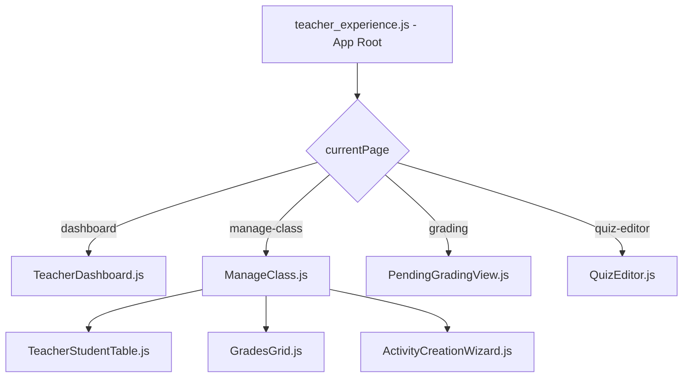

# Arquitectura del Proyecto: Dashboard del Docente (ISI)

Este documento describe la estructura técnica, la arquitectura y los flujos de datos del portal docente desarrollado dentro del plugin `local_grupomakro_core`.

## 1. Visión General
El Dashboard del Docente es una aplicación de **Single Page Application (SPA)** integrada dentro de Moodle. Utiliza un enfoque híbrido:
- **Backend**: Moodle (PHP) proporcionando APIs y servicios externos.
- **Frontend**: Vue.js 2.x con Vuetify 2.x para una interfaz moderna y reactiva.

## 2. Estructura de Directorios Clave

```text
local_grupomakro_core/
├── ajax.php                # Punto de entrada principal para peticiones AJAX del frontend
├── locallib.php            # Biblioteca central de lógica de negocio (PHP)
├── pages/
│   ├── teacher_dashboard.php # Página de entrada (Moodle Page) que monta la App Vue
│   ├── quiz_editor.php     # Página específica para el editor de cuestionarios avanzado
├── js/
│   ├── components/         # Componentes Vue.js (.js puros, cargados vía script)
│   │   ├── TeacherDashboard.js   # Vista principal del dashboard
│   │   ├── ManageClass.js        # Gestión detallada de una clase (Timeline, Estudiantes, etc.)
│   │   ├── QuizEditor.js         # Editor visual de preguntas Cloze/GapSelect
│   │   └── quizeditor/           # Sub-componentes del editor de cuestionarios
│   │       ├── ClozeWizard.js
│   │       ├── TypeEditors.js
│   │       └── QuestionBankDialog.js
├── amd/
│   └── src/
│       └── teacher_experience.js # Inicializador principal y orquestador de rutas (SPA)
├── classes/
│   └── external/           # Servicios externos de Moodle (Web Services)
│       └── teacher/
│           └── get_dashboard_data.php # Proveedor principal de datos para el dashboard
└── styles/
    └── teacher_experience.css # Estilos CSS personalizados (Vanilla CSS + Vuetify)
```

## 3. Arquitectura del Frontend (Vue.js)

### Orquestación de Componentes
La aplicación no utiliza un router formal (como vue-router) para evitar conflictos con las URLs de Moodle, sino que utiliza una **navegación basada en estado** (`currentPage`) controlada en `teacher_experience.js`.



### Comunicación entre Componentes
- **Props**: Para pasar datos hacia abajo (ej. `classId`).
- **Events**: Para comunicación hacia arriba (ej. `@change-page` para navegar).
- **Global Config**: Datos de sesión (`sesskey`), URLs y traducciones se pasan desde PHP mediante un objeto global `config` inicializado en `teacher_dashboard.php`.

## 4. Arquitectura del Backend (PHP)

### Flujo de Datos (AJAX)
Las peticiones suelen seguir este camino:
1.  **Frontend (Axios)** -> `local/grupomakro_core/ajax.php`
2.  `ajax.php` valida la sesión (`sesskey`) y el login.
3.  `ajax.php` despacha a una clase en `classes/external/` o a una función en `locallib.php`.
4.  **Respuesta JSON** de vuelta al frontend.

### Tablas de Datos Principales (Custom)
La lógica de "Clases" e "Instructores" se apoya en tablas personalizadas que extienden el modelo de Moodle:
- `mdl_gmk_class`: Almacena la relación entre cursos, grupos e instructores.
- `mdl_gmk_bbb_attendance_relation`: Vincula sesiones de BigBlueButton con asistencia.
- `mdl_gmk_course_progre`: Rastrea el progreso de los estudiantes en las clases.

## 5. Componentes Críticos

### QuizEditor.js
Uno de los componentes más complejos. Permite editar preguntas de Moodle visualmente.
- **Visual Tokenizer**: Convierte el texto plano en "tokens" clickeables.
- **Smart Cloze Assistant**: Genera sintaxis compleja de Cloze `{1:SHORTANSWER:=...}` automáticamente.
- **GapSelect/DDWTOS Mapper**: Mapea palabras seleccionadas a opciones de respuesta (`[[1]]`).

### ManageClass.js
Centraliza la gestión operativa.
- **Merged Timeline**: Une eventos del calendario de Moodle con sesiones de asistencia de forma transparente.
- **Dynamic Attendance QR**: Genera códigos QR rotativos para la toma de asistencia presencial.

## 6. Consideraciones de Desarrollo
- **Vuetify**: Se utiliza la versión 2.x con CDN o carga local. Los temas claro/oscuro se sincronizan con la preferencia de Moodle.
- **Reactividad**: Dado que se cargan archivos `.js` puros (no `.vue` compilados), las plantillas están embebidas como strings (`template: '...'`).
- **Traducciones**: Se cargan desde el sistema de strings de Moodle (`get_string`) y se pasan al JS mediante el objeto `config.strings`.


Análisis de Arquitectura del Proyecto local_grupomakro_core
Este documento detalla la arquitectura lógica y técnica del sistema, centrada en la gestión de clases, ciclos académicos y asignaturas.

1. Modelo de Entidad-Relación Extendido
El sistema extiende el modelo de datos de Moodle utlizando tablas personalizadas (gmk_* y local_learning_*) que actúan como una capa de abstracción sobre los cursos y usuarios estándar.

A. Gestión de Planes de Estudio (Curriculum)
El sistema jerárquico organiza la oferta académica.

local_learning_plans (Plan de Estudio): La entidad raíz. (Ej: "Licenciatura en Sistemas").
local_learning_periods (Periodos): Divisiones temporales mayores (Ej: "Cuatrimestre 1").
local_learning_subperiods (Bloques): Subdivisiones operativas (Ej: "Bloque A", "Bloque B").
local_learning_courses (Asignaturas del Plan):
Vincula un Curso Moodle (mdl_course) con un Periodo específico.
Define metadatos académicos: Créditos, Horas Teóricas (T), Horas Prácticas (P), Prerrequisitos (JSON).
Tiene un campo isrequired para definir obligatoriedad.
B. Gestión de Clases (gmk_class)
Una "Clase" es la instancia ejecutada de una Asignatura para un grupo de alumnos y un instructor en un momento dado.

Tabla: mdl_gmk_class
Campos Clave:
courseid: ID de la tabla local_learning_courses (Asignatura).
corecourseid: ID del curso nativo de Moodle.
instructorid: ID del usuario Moodle (profesor).
periodid / learningplanid: Contexto académico.
classdays: Cadena binaria "0/1/0/..." representando Lunes-Domingo.
inittime / endtime: Horario.
Integración con Moodle (Automática): Al crear una clase (locallib.php -> create_class), el sistema automáticamente:
Crea un Grupo Moodle (name: {ClassName}-{ClassID}).
Crea una Sección de Curso exclusiva para ese grupo.
Añade una actividad de Asistencia y (opcionalmente) BigBlueButton dentro de esa sección.
C. Estado del Estudiante (local_learning_users)
Rastrea la posición exacta del estudiante en su malla curricular.

Campos: currentperiodid, currentsubperiodid, 
status
 (activo, egresado, etc.).
Lógica de Progreso: Validada en 
classes/local/progress_manager.php
.
2. Lógica de Negocio Crítica
Ciclos Académicos y Progreso
El avance del estudiante no es manual, sino calculado por triggers:

Cálculo de Progreso (
update_course_progress
):

Se ejecuta cuando hay cambios en calificaciones o asistencia.
Si Grade >= 70 OR Progress == 100% -> Marca la materia como COMPLETADA.
Si 60 <= Grade < 70 -> Marca estado PENDIENTE REVALIDA (Examen de recuperación).
Sincronización de Periodo (
sync_student_period
):

Verifica si todas las materias obligatorias del periodo actual están aprobadas.
Si es así, avanza automáticamente el currentperiodid del estudiante al siguiente nivel.
Gestión de Asistencia Híbrida
El sistema soporta clases Presenciales y Virtuales.
Virtual: La asistencia se marca automáticamente si el estudiante entra a la sesión de BigBlueButton (mdl_gmk_bbb_attendance_relation).
Presencial: Se generan códigos QR rotativos (QuizEditor tiene lógica visual, locallib tiene lógica de backend) para que el estudiante escanee y marque asistencia.
3. Frontend (Vue.js)
Componente de Curriculum (
js/components/curriculum.js
)
Visualiza la "Malla Curricular".
Consume el servicio local_grupomakro_get_learning_plan_pensum.
Renderiza tarjetas por periodo con indicadores visuales de estado y prerrequisitos (candados).
Maneja temas Claro/Oscuro sincronizados con Vuetify.
Dashboard Docente (
js/components/TeacherDashboard.js
)
Muestra "Tarjetas de Clase" activas.
Semáforo de Salud:
🟢 Verde: Asistencia normal.
🟡 Amarillo: Alumnos con baja asistencia detectada.
🔴 Rojo: Situación crítica (muchos fallos).
Calcula la "Próxima Sesión" consultando eventos de calendario futuros filtrados por la clase.
4. Flujo de Creación de una Clase (Backend)
El proceso es una transacción compleja orquestada en 
locallib.php
:

Validación: Se verifica disponibilidad del profesor (
check_class_schedule_availability
) cruzando horarios con otras clases activas.
Persistencia: Se inserta el registro en gmk_class.
Moodle Hooks:
groups_create_group()
course_create_section()
add_moduleinfo() (para Attendance y BBB).
Generación de Sesiones: Se pre-crean todas las sesiones de asistencia (y eventos de calendario) desde initdate hasta enddate según los días de la semana elegidos.


## 5. Ciclo de Vida del Estudiante (Periodos y Bloques)

### Niveles de Estado
Para responder con precisión, el "estado" de un estudiante se maneja en **tres niveles distintos**:

#### 1. Estado Académico por Materia (Progreso)
Definido como constantes en `local_grupomakro_progress_manager.php`. Determina la situación del alumno frente a una asignatura específica:

| Código | Constante | Descripción |
| :--- | :--- | :--- |
| `0` | `COURSE_NO_AVAILABLE` | No disponible (materia futura o bloqueada) |
| `1` | `COURSE_AVAILABLE` | Disponible para cursar |
| `2` | `COURSE_IN_PROGRESS` | Cursando actualmente |
| `3` | `COURSE_COMPLETED` | Completada (esperando cierre/aprobación final) |
| `4` | `COURSE_APPROVED` | Aprobada definitivamente (Nota >= 70) |
| `5` | `COURSE_FAILED` | Reprobada |
| `6` | `COURSE_PENDING_REVALID` | Pendiente de Reválida (Nota entre 60 y 69) |
| `7` | `COURSE_REVALIDATING` | En proceso de Reválida |

#### 2. Estado de Matrícula (Global)
Es el estado general del alumno en la institución (ej. Activo, Suspendido, Egresado).
*   **Almacenamiento:** Campo de Perfil de Usuario de Moodle (`mdl_user_info_data`) con shortname `studentstatus`.
*   **Valores:** Configurables en Moodle. Por defecto asume 'Activo' si está vacío.

#### 3. Estado Financiero
Sincronizado desde el ERP (Odoo) y almacenado en `mdl_gmk_financial_status`.
*   **Valores típicos:** `al_dia`, `mora`, `becado`, `none`.
*   **Uso:** Restringe accesos o muestra alertas en el dashboard.

### Lógica de Sincronización de Periodos
El avance del estudiante entre periodos (ej. Cuatrimestre 1 -> Cuatrimestre 2) se gestiona mediante la función `sync_student_period` en `progress_manager.php`.
*   **Trigger:** Se ejecuta tras la completitud de cursos o mediante tareas programadas.
*   **Mecanismo:** El sistema evalúa si **todas** las materias obligatorias (`isrequired=1`) del periodo actual están aprobadas. Si es así, actualiza automáticamente el campo `currentperiodid` en la tabla `local_learning_users`.
*   **Notas:** Existe una variante `sync_student_period_by_count` usada en migraciones que calcula el periodo basándose en el conteo total de materias aprobadas vs la capacidad del plan.

## 6. Calendario Académico (`gmk_academic_calendar`)

### Propósito y Uso
Aunque existe una tabla `mdl_gmk_academic_calendar` (definida en `install.xml`), el análisis del código base (`locallib.php`, `progress_manager.php`) revela que **no se utiliza para la lógica crítica de transición de periodos**.

*   **Función:** Es puramente informativa para mostrar fechas clave (inicios de clases, feriados, exámenes) en el dashboard.
*   **Independencia:** El cambio de periodo del estudiante es **asíncrono e individual**, basado en su propio progreso académico, no en una fecha fija del calendario institucional. Esto permite que diferentes estudiantes avancen a ritmos distintos dentro del mismo plan, soportando modelos de educación personalizada o autogestionada.
