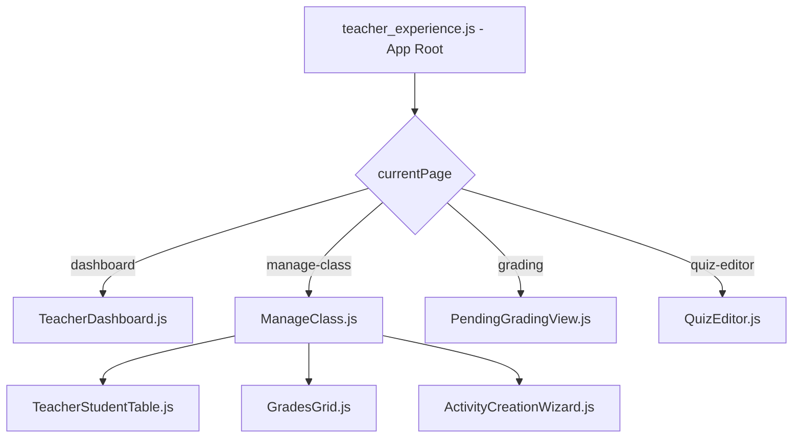

# Arquitectura del Proyecto: Dashboard del Docente (ISI)

Este documento describe la estructura técnica, la arquitectura y los flujos de datos del portal docente desarrollado dentro del plugin `local_grupomakro_core`.

## 1. Visión General
El Dashboard del Docente es una aplicación de **Single Page Application (SPA)** integrada dentro de Moodle. Utiliza un enfoque híbrido:
- **Backend**: Moodle (PHP) proporcionando APIs y servicios externos.
- **Frontend**: Vue.js 2.x con Vuetify 2.x para una interfaz moderna y reactiva.

## 2. Estructura de Directorios Clave

```text
local_grupomakro_core/
├── ajax.php                # Punto de entrada principal para peticiones AJAX del frontend
├── locallib.php            # Biblioteca central de lógica de negocio (PHP)
├── pages/
│   ├── teacher_dashboard.php # Página de entrada (Moodle Page) que monta la App Vue
│   ├── quiz_editor.php     # Página específica para el editor de cuestionarios avanzado
├── js/
│   ├── components/         # Componentes Vue.js (.js puros, cargados vía script)
│   │   ├── TeacherDashboard.js   # Vista principal del dashboard
│   │   ├── ManageClass.js        # Gestión detallada de una clase (Timeline, Estudiantes, etc.)
│   │   ├── QuizEditor.js         # Editor visual de preguntas Cloze/GapSelect
│   │   └── quizeditor/           # Sub-componentes del editor de cuestionarios
│   │       ├── ClozeWizard.js
│   │       ├── TypeEditors.js
│   │       └── QuestionBankDialog.js
├── amd/
│   └── src/
│       └── teacher_experience.js # Inicializador principal y orquestador de rutas (SPA)
├── classes/
│   └── external/           # Servicios externos de Moodle (Web Services)
│       └── teacher/
│           └── get_dashboard_data.php # Proveedor principal de datos para el dashboard
└── styles/
    └── teacher_experience.css # Estilos CSS personalizados (Vanilla CSS + Vuetify)
```

## 3. Arquitectura del Frontend (Vue.js)

### Orquestación de Componentes
La aplicación no utiliza un router formal (como vue-router) para evitar conflictos con las URLs de Moodle, sino que utiliza una **navegación basada en estado** (`currentPage`) controlada en `teacher_experience.js`.



### Comunicación entre Componentes
- **Props**: Para pasar datos hacia abajo (ej. `classId`).
- **Events**: Para comunicación hacia arriba (ej. `@change-page` para navegar).
- **Global Config**: Datos de sesión (`sesskey`), URLs y traducciones se pasan desde PHP mediante un objeto global `config` inicializado en `teacher_dashboard.php`.

## 4. Arquitectura del Backend (PHP)

### Flujo de Datos (AJAX)
Las peticiones suelen seguir este camino:
1.  **Frontend (Axios)** -> `local/grupomakro_core/ajax.php`
2.  `ajax.php` valida la sesión (`sesskey`) y el login.
3.  `ajax.php` despacha a una clase en `classes/external/` o a una función en `locallib.php`.
4.  **Respuesta JSON** de vuelta al frontend.

### Tablas de Datos Principales (Custom)
La lógica de "Clases" e "Instructores" se apoya en tablas personalizadas que extienden el modelo de Moodle:
- `mdl_gmk_class`: Almacena la relación entre cursos, grupos e instructores.
- `mdl_gmk_bbb_attendance_relation`: Vincula sesiones de BigBlueButton con asistencia.
- `mdl_gmk_course_progre`: Rastrea el progreso de los estudiantes en las clases.

## 5. Componentes Críticos

### QuizEditor.js
Uno de los componentes más complejos. Permite editar preguntas de Moodle visualmente.
- **Visual Tokenizer**: Convierte el texto plano en "tokens" clickeables.
- **Smart Cloze Assistant**: Genera sintaxis compleja de Cloze `{1:SHORTANSWER:=...}` automáticamente.
- **GapSelect/DDWTOS Mapper**: Mapea palabras seleccionadas a opciones de respuesta (`[[1]]`).

### ManageClass.js
Centraliza la gestión operativa.
- **Merged Timeline**: Une eventos del calendario de Moodle con sesiones de asistencia de forma transparente.
- **Dynamic Attendance QR**: Genera códigos QR rotativos para la toma de asistencia presencial.

## 6. Consideraciones de Desarrollo
- **Vuetify**: Se utiliza la versión 2.x con CDN o carga local. Los temas claro/oscuro se sincronizan con la preferencia de Moodle.
- **Reactividad**: Dado que se cargan archivos `.js` puros (no `.vue` compilados), las plantillas están embebidas como strings (`template: '...'`).
- **Traducciones**: Se cargan desde el sistema de strings de Moodle (`get_string`) y se pasan al JS mediante el objeto `config.strings`.
